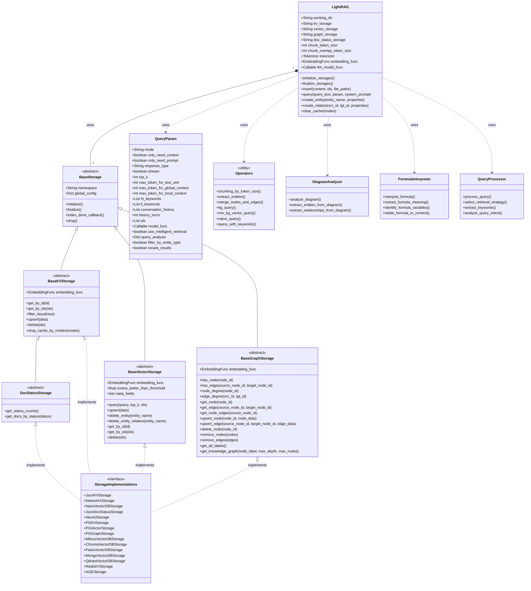

# Component Interaction Diagram

This class diagram shows the core classes of LightRAG and how they interact with each other, illustrating the object-oriented design of the system.

## Diagram Description

The diagram represents the following key components and their relationships:

1. **LightRAG**: The main class that users interact with, containing methods for document insertion, querying, and knowledge graph management. It coordinates all other components and implements the core functionality of the system.

2. **Storage Abstractions**: A hierarchy of abstract classes that define interfaces for different storage types:
   - **BaseStorage**: The root abstract class for all storage types
   - **BaseKVStorage**: For key-value storage implementations
   - **BaseVectorStorage**: For vector database implementations
   - **BaseGraphStorage**: For knowledge graph storage implementations
   - **DocStatusStorage**: For document processing status tracking

3. **Storage Implementations**: Various concrete implementations of the storage abstractions, including:
   - JSON file storage options
   - Database integrations (Neo4j, PostgreSQL, MongoDB, etc.)
   - Vector databases (FAISS, Milvus, Chroma, etc.)
   - Graph databases and in-memory options

4. **QueryParam**: A data class that encapsulates all configuration options for queries, including retrieval mode, token limits, and various flags for controlling the query behavior.

5. **Utility Classes**:
   - **Operators**: Functions for chunking, extraction, and query processing
   - **DiagramAnalyzer**: For processing diagrams in documents
   - **FormulaInterpreter**: For handling mathematical formulas
   - **QueryProcessor**: For analyzing and optimizing queries

The diagram illustrates the composition relationships between LightRAG and its storage components, as well as the inheritance hierarchies within the storage abstractions. It also shows how the various utility classes are used by the core LightRAG class.

