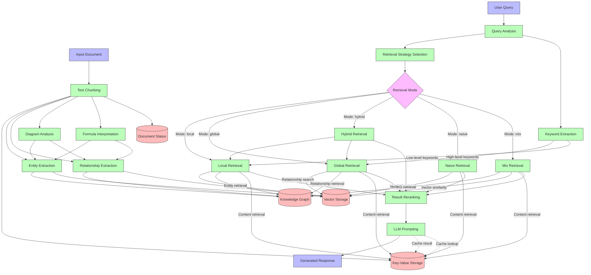

# Data Flow Diagram

This flowchart illustrates how data moves through the LightRAG system, from input documents and queries to storage and response generation.

## Diagram Description

The diagram tracks two primary data flows:

### Document Processing Flow

1. **Input**: Documents enter the system and begin the processing pipeline
2. **Chunking**: Documents are divided into manageable chunks based on token size
3. **Analysis**: Different types of analysis are performed:
   - Entity Extraction identifies named entities
   - Relationship Extraction identifies connections between entities
   - Diagram Analysis extracts information from visual elements
   - Formula Interpretation handles mathematical content
4. **Storage**: The processed information is stored in different storage systems:
   - Text chunks go to Key-Value Storage
   - Entity and relationship embeddings go to Vector Storage
   - Entity and relationship metadata go to Knowledge Graph Storage
   - Processing status is tracked in Document Status Storage

### Query Processing Flow

1. **Input**: User query enters the system
2. **Analysis**: The query is analyzed to extract:
   - Query intent and type
   - High-level and low-level keywords
3. **Strategy Selection**: Based on analysis, a retrieval strategy is chosen
4. **Retrieval**: Different modes retrieve information differently:
   - Local mode focuses on entities
   - Global mode focuses on relationships
   - Hybrid mode combines local and global approaches
   - Naive mode uses simple vector similarity
   - Mix mode integrates knowledge graph and vector retrieval
5. **Reranking**: Results are reranked based on relevance
6. **LLM Prompting**: Retrieved context is combined with the query in a prompt
7. **Response Generation**: The LLM generates a response based on the prompt

The diagram also shows how caching works, with results being stored for future queries and lookups happening before processing.

