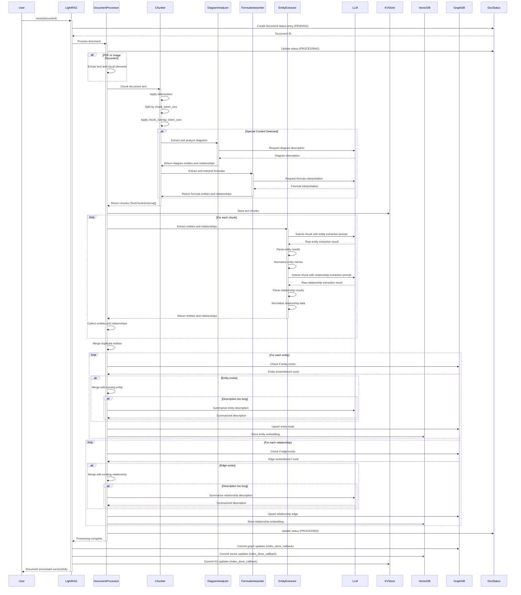

# Document Processing Pipeline Diagram

This sequence diagram details the step-by-step process of how documents are ingested, processed, and stored in the LightRAG system.

## Diagram Description

The document processing pipeline involves these major steps:

1. **Initial Processing**:
   - The user submits a document to LightRAG via the `insert()` method
   - LightRAG creates a document status entry with PENDING status
   - The document processor begins processing the document
   - Document status is updated to PROCESSING

2. **Document Analysis and Chunking**:
   - For PDF or image documents, text and visual elements are extracted
   - The document is split into chunks based on token size and overlap settings
   - Special content like diagrams and formulas receive additional processing:
     - Diagrams are analyzed using vision capabilities to extract entities and relationships
     - Formulas are interpreted to understand their meaning and context
   - Chunks are stored in the Key-Value storage

3. **Entity and Relationship Extraction**:
   - For each chunk, an LLM is used to extract entities with structured prompting
   - Entity results are parsed and normalized
   - Similarly, relationships between entities are extracted using LLM
   - Relationship results are parsed and normalized

4. **Knowledge Graph Construction**:
   - Detected entities are collected and processed
   - Duplicate entities are merged
   - For each entity:
     - If it already exists in the graph, it's merged with the existing entity
     - If descriptions become too long, an LLM summarizes them
     - The entity node is upserted to the graph and its embedding to the vector database
   - For each relationship:
     - If it already exists, it's merged with the existing relationship
     - If descriptions become too long, an LLM summarizes them
     - The relationship edge is upserted to the graph and its embedding to the vector database

5. **Finalization**:
   - Document status is updated to PROCESSED
   - Storage updates are committed via index_done_callback
   - Success is reported back to the user

The diagram shows the interaction between the User, LightRAG, and various components like the DocumentProcessor, Chunker, EntityExtractor, storage systems, and the LLM. It illustrates both the sequential nature of document processing and the parallel processing of multiple chunks for efficiency.

