# LLM Integration Diagram

This diagram illustrates how LightRAG integrates with various Large Language Model (LLM) providers and manages LLM-related functionality.

## Diagram Description

The LLM integration architecture consists of several key components:

1. **LLM Adapter Layer**: A central component that standardizes interactions with different LLM providers, providing a consistent interface for the core LightRAG system.

2. **Provider Implementations**: Concrete implementations for different LLM services:
   - OpenAI (ChatGPT, GPT-4)
   - Azure OpenAI Service
   - Anthropic (Claude models)
   - Google (Gemini models)
   - Hugging Face (local and hosted models)
   - LlamaIndex (integration layer)
   - LMDeploy (deployment tools)
   - SiliconCloud
   - Zhipu AI
   - LoLLMs (local models)
   - AWS Bedrock
   - Jina
   - NVIDIA 

3. **Embedding Generation**: Components for creating vector embeddings from text:
   - Standard embedding functions
   - Enhanced embedding with additional processing for better semantic understanding
   - Batch processing for efficiency
   - Caching mechanisms for previously embedded content

4. **LLM Generation**: Components for text generation:
   - Priority handling for managing concurrent requests
   - Asynchronous execution for non-blocking operations
   - Caching to avoid redundant LLM calls
   - Token usage tracking for monitoring and cost management

5. **Function Flows**: The diagram shows two key flows:
   - **LLM Function Call Flow**: The process from input request to output response, including cache checking, priority assignment, asynchronous execution, API calls, token counting, and cache storage.
   - **Embedding Flow**: The process of converting text to vector embeddings, including cache checking, batch processing, and provider API calls.

The diagram illustrates how the LLM adapter layer abstracts away the differences between providers, allowing LightRAG to work with many different LLM services without modifying the core system. It also shows how features like caching, priority handling, and token tracking are implemented across the system.

```mermaid
graph TB
    subgraph "LightRAG System"
        LightRAG["LightRAG Core"]
        
        subgraph "LLM Module"
            LLMAdapter["LLM Adapter Layer"]
            
            EmbeddingGen["Embedding Generator"]
            
            subgraph "Enhanced Embedding"
                EnhEmbedding["Enhanced Embedding<br>Processor"]
                PrioritySetting["Priority Settings"]
                BatchProcEmbedding["Batch Processing"]
                CacheEmbedding["Embedding Cache"]
            end
            
            subgraph "LLM Generator"
                LLMGen["LLM Generator"]
                PriorityLLM["Priority Handler"]
                AsyncLLM["Async Executor"]
                CacheLLM["LLM Cache"]
                TokenTracking["Token Usage Tracking"]
            end
            
            LLMAdapter --> LLMGen
            LLMAdapter --> EmbeddingGen
            EmbeddingGen --> EnhEmbedding
        end
        
        subgraph "Provider Implementations"
            OpenAIImpl["OpenAI Implementation"]
            AzureOpenAIImpl["Azure OpenAI Implementation"]
            AnthropicImpl["Anthropic Implementation"]
            GeminiImpl["Google Gemini Implementation"]
            HuggingFaceImpl["Hugging Face Implementation"]
            LlamaIndexImpl["LlamaIndex Implementation"]
            LMDeployImpl["LMDeploy Implementation"]
            SiliconCloudImpl["SiliconCloud Implementation"]
            ZhipuImpl["Zhipu Implementation"]
            LoLLMsImpl["LoLLMs Implementation"]
            BedrockImpl["AWS Bedrock Implementation"]
            JinaImpl["Jina Implementation"]
            NvidiaImpl["NVIDIA Implementation"]
        end
    end
    
    subgraph "External LLM Services"
        OpenAI["OpenAI API"]
        Azure["Azure OpenAI API"]
        Anthropic["Anthropic Claude API"]
        Gemini["Google Gemini API"]
        HF["Hugging Face Models"]
        LocalModels["Local Models"]
        Bedrock["AWS Bedrock API"]
        Jina["Jina API"]
        NVIDIA["NVIDIA API"]
    end
    
    %% LLM implementation connections
    OpenAIImpl <--> OpenAI
    AzureOpenAIImpl <--> Azure
    AnthropicImpl <--> Anthropic
    GeminiImpl <--> Gemini
    HuggingFaceImpl <--> HF
    LMDeployImpl <--> LocalModels
    LoLLMsImpl <--> LocalModels
    BedrockImpl <--> Bedrock
    JinaImpl <--> Jina
    NvidiaImpl <--> NVIDIA
    
    %% LLM adapter connections
    OpenAIImpl --> LLMAdapter
    AzureOpenAIImpl --> LLMAdapter
    AnthropicImpl --> LLMAdapter
    GeminiImpl --> LLMAdapter
    HuggingFaceImpl --> LLMAdapter
    LlamaIndexImpl --> LLMAdapter
    LMDeployImpl --> LLMAdapter
    SiliconCloudImpl --> LLMAdapter
    ZhipuImpl --> LLMAdapter
    LoLLMsImpl --> LLMAdapter
    BedrockImpl --> LLMAdapter
    JinaImpl --> LLMAdapter
    NvidiaImpl --> LLMAdapter
    
    %% Core connections
    LightRAG <--> LLMAdapter
    
    %% Function call flows
    subgraph "Function Flow"
        direction TB
        Input["Input Request"]
        FuncCall["LLM Function Call"]
        Cache["Cache Check"]
        Priority["Priority Assignment"]
        AsyncExec["Async Execution"]
        ProviderCall["Provider API Call"]
        TokenCount["Token Counting"]
        CacheStore["Cache Storage"]
        Output["Output Response"]
        
        Input --> FuncCall
        FuncCall --> Cache
        
        Cache -- "Cache Hit" --> Output
        Cache -- "Cache Miss" --> Priority
        Priority --> AsyncExec
        AsyncExec --> ProviderCall
        ProviderCall --> TokenCount
        TokenCount --> CacheStore
        CacheStore --> Output
    end
    
    %% Embedding flow
    subgraph "Embedding Flow"
        direction TB
        TextInput["Text Input"]
        EmbedFunc["Embedding Function"]
        EmbedCache["Cache Check"]
        Batch["Batch Processing"]
        EmbedProvider["Provider API Call"]
        VectorOutput["Vector Output"]
        
        TextInput --> EmbedFunc
        EmbedFunc --> EmbedCache
        EmbedCache -- "Cache Hit" --> VectorOutput
        EmbedCache -- "Cache Miss" --> Batch
        Batch --> EmbedProvider
        EmbedProvider --> VectorOutput
    end
    
    classDef core fill:#f9f,stroke:#333,stroke-width:2px
    classDef adapter fill:#bbf,stroke:#333,stroke-width:1px
    classDef implementation fill:#bfb,stroke:#333,stroke-width:1px
    classDef external fill:#ddd,stroke:#333,stroke-width:1px
    classDef flow fill:#fff,stroke:#333,stroke-width:1px,stroke-dasharray: 5 5
    
    class LightRAG core
    class LLMAdapter,EmbeddingGen,EnhEmbedding,PrioritySetting,BatchProcEmbedding,CacheEmbedding,LLMGen,PriorityLLM,AsyncLLM,CacheLLM,TokenTracking adapter
    class OpenAIImpl,AzureOpenAIImpl,AnthropicImpl,GeminiImpl,HuggingFaceImpl,LlamaIndexImpl,LMDeployImpl,SiliconCloudImpl,ZhipuImpl,LoLLMsImpl,BedrockImpl,JinaImpl,NvidiaImpl implementation
    class OpenAI,Azure,Anthropic,Gemini,HF,LocalModels,Bedrock,Jina,NVIDIA external
    class Input,FuncCall,Cache,Priority,AsyncExec,ProviderCall,TokenCount,CacheStore,Output,TextInput,EmbedFunc,EmbedCache,Batch,EmbedProvider,VectorOutput flow
```

