# Knowledge Graph Storage Diagram

This diagram details the storage architecture of LightRAG, focusing on the different storage implementations, their capabilities, and how they interact with external systems.

## Diagram Description

The knowledge graph storage architecture consists of these main components:

1. **Storage Abstractions**: The base abstract classes that define interfaces for different storage types:
   - **BaseStorage**: The root abstract class with core storage methods
   - **BaseKVStorage**: For key-value storage of documents and chunks
   - **BaseVectorStorage**: For vector embeddings storage
   - **BaseGraphStorage**: For knowledge graph nodes and edges
   - **DocStatusStorage**: For tracking document processing status

2. **Storage Implementations**: The concrete implementations of storage abstractions:
   - **KV Storage**: JSON files, Redis, MongoDB, PostgreSQL
   - **Vector Storage**: Local vectors, FAISS, Chroma, Milvus, PostgreSQL pgvector, MongoDB Atlas, Qdrant
   - **Graph Storage**: NetworkX (in-memory), Neo4j, Apache AGE, Gremlin, PostgreSQL
   - **Doc Status Storage**: JSON files, PostgreSQL, MongoDB
   - **Enhanced Storage**: Schema-aware and synchronization-aware implementations

3. **External Systems**: The actual database systems that implementations connect to:
   - Neo4j Database
   - PostgreSQL Database
   - Redis Database
   - MongoDB Database
   - Milvus Server
   - Chroma Server
   - Qdrant Server
   - Gremlin-compatible Databases

4. **Storage Components**: The types of data stored in the system:
   - Entity Storage (nodes in knowledge graph)
   - Relationship Storage (edges in knowledge graph)
   - Entity and Relationship Embeddings (vector representations)
   - Text Chunks (document segments)
   - LLM Response Cache (saved LLM outputs)
   - Document Status (processing state tracking)

5. **Storage Location**: Classification of storage implementations:
   - Local Storage (file-based and in-memory implementations)
   - Remote Storage (database servers and cloud services)

6. **Storage Capabilities**: Features provided by different implementations:
   - Persistence (data durability across restarts)
   - High Performance (query speed optimization)
   - Scalability (handling large data volumes)
   - Schema Enforcement (validating data against schemas)
   - Multi-Process Support (concurrent access from multiple processes)

The diagram shows how LightRAG connects to different storage implementations through the abstract interfaces, allowing for flexible configuration and easy switching between storage backends. It also illustrates which implementations provide which capabilities, helping users choose the right storage options for their needs.

```mermaid
graph TB
    %% Core classes
    LightRAG["LightRAG Core"]
    
    subgraph "Storage Abstractions"
        BaseStorage["BaseStorage<br>Abstract Class"]
        BaseKVStorage["BaseKVStorage<br>Abstract Class"]
        BaseVectorStorage["BaseVectorStorage<br>Abstract Class"]
        BaseGraphStorage["BaseGraphStorage<br>Abstract Class"]
        DocStatusStorage["DocStatusStorage<br>Abstract Class"]
        
        BaseStorage --> BaseKVStorage
        BaseStorage --> BaseVectorStorage
        BaseStorage --> BaseGraphStorage
        BaseKVStorage --> DocStatusStorage
    end
    
    subgraph "Storage Implementations"
        subgraph "KV Storage"
            JsonKV["JsonKVStorage<br>Local JSON File"]
            RedisKV["RedisKVStorage<br>Redis Database"]
            MongoKV["MongoKVStorage<br>MongoDB"]
            PGKV["PGKVStorage<br>PostgreSQL"]
        end
        
        subgraph "Vector Storage"
            NanoVector["NanoVectorDBStorage<br>Local Vector Files"]
            FaissVector["FaissVectorDBStorage<br>FAISS Library"]
            ChromaVector["ChromaVectorDBStorage<br>ChromaDB"]
            MilvusVector["MilvusVectorDBStorage<br>Milvus VectorDB"]
            PGVector["PGVectorStorage<br>PostgreSQL pgvector"]
            MongoVector["MongoVectorDBStorage<br>MongoDB Atlas Vector"]
            QdrantVector["QdrantVectorDBStorage<br>Qdrant VectorDB"]
        end
        
        subgraph "Graph Storage"
            NetworkX["NetworkXStorage<br>In-memory Graph"]
            Neo4J["Neo4JStorage<br>Neo4j Database"]
            AGE["AGEStorage<br>Apache AGE on PostgreSQL"]
            Gremlin["GremlinStorage<br>Gremlin Graph DB"]
            PGGraph["PGGraphStorage<br>PostgreSQL Graph"]
        end
        
        subgraph "Doc Status Storage"
            JsonDocStatus["JsonDocStatusStorage<br>Local JSON File"]
            PGDocStatus["PGDocStatusStorage<br>PostgreSQL"]
            MongoDocStatus["MongoDocStatusStorage<br>MongoDB"]
        end
        
        subgraph "Enhanced Storage"
            SchemaAware["SchemaAwareGraph<br>Schema-Enforced Graph"]
            SchemaAwareNeo4j["SchemaAwareNeo4j<br>Schema + Neo4j"]
            SyncAwareNeo4j["SyncAwareNeo4j<br>Multi-Process Safe"]
        end
    end
    
    %% Interface implementations
    BaseKVStorage --> JsonKV
    BaseKVStorage --> RedisKV
    BaseKVStorage --> MongoKV
    BaseKVStorage --> PGKV
    
    BaseVectorStorage --> NanoVector
    BaseVectorStorage --> FaissVector
    BaseVectorStorage --> ChromaVector
    BaseVectorStorage --> MilvusVector
    BaseVectorStorage --> PGVector
    BaseVectorStorage --> MongoVector
    BaseVectorStorage --> QdrantVector
    
    BaseGraphStorage --> NetworkX
    BaseGraphStorage --> Neo4J
    BaseGraphStorage --> AGE
    BaseGraphStorage --> Gremlin
    BaseGraphStorage --> PGGraph
    
    DocStatusStorage --> JsonDocStatus
    DocStatusStorage --> PGDocStatus
    DocStatusStorage --> MongoDocStatus
    
    Neo4J --> SchemaAwareNeo4j
    SchemaAwareNeo4j --> SyncAwareNeo4j
    BaseGraphStorage --> SchemaAware
    
    %% LightRAG connections
    LightRAG --> BaseKVStorage
    LightRAG --> BaseVectorStorage
    LightRAG --> BaseGraphStorage
    LightRAG --> DocStatusStorage
    
    %% External storage systems
    subgraph "External Systems"
        Neo4jDB["Neo4j Database"]
        PostgresDB["PostgreSQL Database"]
        RedisDB["Redis Database"]
        MongoDB["MongoDB Database"]
        MilvusDB["Milvus Server"]
        ChromaDB["Chroma Server"]
        QdrantDB["Qdrant Server"]
        GremlinDB["Gremlin-Compatible DB"]
    end
    
    Neo4J <--> Neo4jDB
    SyncAwareNeo4j <--> Neo4jDB
    SchemaAwareNeo4j <--> Neo4jDB
    PGGraph <--> PostgresDB
    PGKV <--> PostgresDB
    PGVector <--> PostgresDB
    PGDocStatus <--> PostgresDB
    AGE <--> PostgresDB
    RedisKV <--> RedisDB
    MongoKV <--> MongoDB
    MongoVector <--> MongoDB
    MongoDocStatus <--> MongoDB
    MilvusVector <--> MilvusDB
    ChromaVector <--> ChromaDB
    QdrantVector <--> QdrantDB
    Gremlin <--> GremlinDB
    
    %% Storage components
    subgraph "Storage Components"
        EntityStorage["Entity Storage<br>Nodes in KG"]
        RelationshipStorage["Relationship Storage<br>Edges in KG"]
        EntityEmbeddings["Entity Embeddings<br>Vector Representations"]
        RelationshipEmbeddings["Relationship Embeddings<br>Vector Representations"]
        TextChunks["Text Chunks<br>Document Segments"]
        LLMCache["LLM Response Cache<br>Cached LLM Outputs"]
        DocumentStatus["Document Status<br>Processing State"]
    end
    
    %% Label storage as either local or remote
    subgraph "Storage Location"
        LocalStorage["Local Storage<br>File-based & In-memory"]
        RemoteStorage["Remote Storage<br>Database Servers"]
    end
    
    JsonKV --> LocalStorage
    NanoVector --> LocalStorage
    NetworkX --> LocalStorage
    JsonDocStatus --> LocalStorage
    
    Neo4J --> RemoteStorage
    PGGraph --> RemoteStorage
    RedisKV --> RemoteStorage
    MilvusVector --> RemoteStorage
    ChromaVector --> RemoteStorage
    QdrantVector --> RemoteStorage
    MongoKV --> RemoteStorage
    AGE --> RemoteStorage
    Gremlin --> RemoteStorage
    
    %% Storage capabilities
    subgraph "Storage Capabilities"
        Persistence["Persistence<br>Data Durability"]
        HighPerformance["High Performance<br>Query Speed"]
        Scalability["Scalability<br>Data Volume Growth"]
        SchemaEnforcement["Schema Enforcement<br>Data Validation"]
        MultiProcess["Multi-Process Support<br>Concurrent Access"]
    end
    
    %% Connect primary storage patterns with capabilities
    RemoteStorage --> Persistence
    RemoteStorage --> HighPerformance
    RemoteStorage --> Scalability
    
    SchemaAware --> SchemaEnforcement
    SchemaAwareNeo4j --> SchemaEnforcement
    
    SyncAwareNeo4j --> MultiProcess
    RemoteStorage --> MultiProcess
    
    classDef core fill:#f9f,stroke:#333,stroke-width:2px
    classDef abstract fill:#bbf,stroke:#333,stroke-width:1px
    classDef implementation fill:#bfb,stroke:#333,stroke-width:1px
    classDef external fill:#ddd,stroke:#333,stroke-width:1px
    classDef component fill:#fcf,stroke:#333,stroke-width:1px
    classDef capability fill:#cff,stroke:#333,stroke-width:1px
    classDef location fill:#ffc,stroke:#333,stroke-width:1px
    
    class LightRAG core
    class BaseStorage,BaseKVStorage,BaseVectorStorage,BaseGraphStorage,DocStatusStorage abstract
    class JsonKV,RedisKV,MongoKV,PGKV,NanoVector,FaissVector,ChromaVector,MilvusVector,PGVector,MongoVector,QdrantVector,NetworkX,Neo4J,AGE,Gremlin,PGGraph,JsonDocStatus,PGDocStatus,MongoDocStatus,SchemaAware,SchemaAwareNeo4j,SyncAwareNeo4j implementation
    class Neo4jDB,PostgresDB,RedisDB,MongoDB,MilvusDB,ChromaDB,QdrantDB,GremlinDB external
    class EntityStorage,RelationshipStorage,EntityEmbeddings,RelationshipEmbeddings,TextChunks,LLMCache,DocumentStatus component
    class Persistence,HighPerformance,Scalability,SchemaEnforcement,MultiProcess capability
    class LocalStorage,RemoteStorage location
```

