# Query Processing Diagram

This sequence diagram details the step-by-step process of how user queries are processed, how relevant information is retrieved, and how responses are generated in the LightRAG system.

## Diagram Description

The query processing pipeline involves these major steps:

1. **Query Submission and Caching**:
   - The user submits a query with query parameters to LightRAG
   - If LLM caching is enabled, LightRAG checks for a cached response
   - If a cache hit occurs, the cached response is returned immediately

2. **Query Analysis**:
   - If automatic mode selection or intelligent retrieval is enabled:
     - The query intent and type are analyzed using an LLM
     - A strategy selector recommends the optimal retrieval mode
     - The query_param.mode is updated with the recommendation
   - Keywords are extracted from the query (either via LLM or basic extraction)
     - High-level keywords (hl_keywords) for relationship retrieval
     - Low-level keywords (ll_keywords) for entity retrieval

3. **Retrieval Process**: Different modes retrieve information differently
   - **Naive Mode**:
     - Queries vector database with keywords
     - Retrieves actual content from KV store for top matches
     - Assembles context from retrieved chunks
   - **Local Mode**:
     - Queries vector database for entities matching ll_keywords
     - Gets entity details from graph database
     - Retrieves associated content chunks
     - Combines entity information into context
   - **Global Mode**:
     - Queries vector database for relationships matching hl_keywords
     - Gets relationship details from graph database
     - Gets connected entity nodes
     - Retrieves associated content chunks
     - Combines relationship information into context
   - **Hybrid Mode**:
     - Performs both local and global retrieval in parallel
     - Combines the results from both approaches
   - **Mix Mode**:
     - Retrieves graph substructures matching keywords
     - Performs vector similarity search
     - Gets associated content chunks
     - Combines knowledge graph and vector results with weighting

4. **Response Generation**:
   - If only_need_context is true, returns the context without LLM generation
   - Otherwise, creates a prompt with the retrieved context
   - If conversation_history is provided, includes relevant history
   - If system_prompt is provided, uses it; otherwise uses default
   - If only_need_prompt is true, returns the prepared prompt
   - Otherwise, sends the prompt to the LLM for response generation
     - If stream is true, streams response chunks directly to the user
     - Otherwise, gets the complete response, caches it, and returns it

The diagram illustrates the interaction between the User, LightRAG, and various components like the QueryProcessor, KeywordExtractor, StrategySelector, and storage systems. It shows both the sequential nature of query processing and the parallel retrieval operations that occur in some modes.

```mermaid
sequenceDiagram
    participant User
    participant LightRAG
    participant QueryProcessor
    participant KeywordExtractor
    participant StrategySelector
    participant LLMCache
    participant KVStore
    participant VectorDB
    participant GraphDB
    participant LLM
    
    User->>LightRAG: query(query, query_param)
    activate LightRAG
    
    Note over LightRAG: Query param contains mode: 'local', 'global', 'hybrid', 'naive', 'mix', or 'auto'
    
    alt LLM Cache Enabled
        LightRAG->>LLMCache: Check for cached query response
        LLMCache-->>LightRAG: Return cached response or null
        
        alt Cache Hit
            LightRAG-->>User: Return cached response
        end
    end
    
    LightRAG->>QueryProcessor: Process query
    activate QueryProcessor
    
    alt Auto Mode or Intelligent Retrieval Enabled
        QueryProcessor->>LLM: Analyze query intent and type
        LLM-->>QueryProcessor: Query analysis result
        
        QueryProcessor->>StrategySelector: Select optimal retrieval strategy
        activate StrategySelector
        StrategySelector->>StrategySelector: Analyze query characteristics
        StrategySelector-->>QueryProcessor: Recommended query mode
        deactivate StrategySelector
        
        QueryProcessor->>QueryProcessor: Update query_param.mode with recommendation
    end
    
    QueryProcessor->>KeywordExtractor: Extract keywords
    activate KeywordExtractor
    
    alt LLM Keyword Extraction Enabled
        KeywordExtractor->>LLM: Extract high and low level keywords
        LLM-->>KeywordExtractor: Extracted keywords
    else
        KeywordExtractor->>KeywordExtractor: Basic keyword extraction
    end
    
    KeywordExtractor-->>QueryProcessor: Return hl_keywords and ll_keywords
    deactivate KeywordExtractor
    
    QueryProcessor-->>LightRAG: Return processed query and keywords
    deactivate QueryProcessor
    
    alt mode == "naive"
        LightRAG->>VectorDB: Query vector database with keywords
        VectorDB-->>LightRAG: Return top_k vectors
        
        loop For each vector result
            LightRAG->>KVStore: Retrieve actual content
            KVStore-->>LightRAG: Return chunk content
        end
        
        LightRAG->>LightRAG: Assemble context from chunks
    
    else if mode == "local"
        LightRAG->>VectorDB: Query for entities with ll_keywords
        VectorDB-->>LightRAG: Return top matching entities
        
        loop For each entity
            LightRAG->>GraphDB: Get entity details
            GraphDB-->>LightRAG: Return entity node data
            
            LightRAG->>KVStore: Get associated content chunks
            KVStore-->>LightRAG: Return content chunks
        end
        
        LightRAG->>LightRAG: Combine entity information into context
    
    else if mode == "global"
        LightRAG->>VectorDB: Query for relationships with hl_keywords
        VectorDB-->>LightRAG: Return top matching relationships
        
        loop For each relationship
            LightRAG->>GraphDB: Get relationship details
            GraphDB-->>LightRAG: Return relationship edge data
            
            LightRAG->>GraphDB: Get connected entity nodes
            GraphDB-->>LightRAG: Return entity node data
            
            LightRAG->>KVStore: Get associated content chunks
            KVStore-->>LightRAG: Return content chunks
        end
        
        LightRAG->>LightRAG: Combine relationship information into context
    
    else if mode == "hybrid"
        par Local Retrieval
            LightRAG->>VectorDB: Query for entities with ll_keywords
            VectorDB-->>LightRAG: Return top matching entities
            
            loop For each entity
                LightRAG->>GraphDB: Get entity details
                GraphDB-->>LightRAG: Return entity node data
                
                LightRAG->>KVStore: Get associated content chunks
                KVStore-->>LightRAG: Return content chunks
            end
        and Global Retrieval
            LightRAG->>VectorDB: Query for relationships with hl_keywords
            VectorDB-->>LightRAG: Return top matching relationships
            
            loop For each relationship
                LightRAG->>GraphDB: Get relationship details
                GraphDB-->>LightRAG: Return relationship edge data
                
                LightRAG->>GraphDB: Get connected entity nodes
                GraphDB-->>LightRAG: Return entity node data
                
                LightRAG->>KVStore: Get associated content chunks
                KVStore-->>LightRAG: Return content chunks
            end
        end
        
        LightRAG->>LightRAG: Combine local and global information into context
    
    else if mode == "mix"
        par Knowledge Graph Retrieval
            LightRAG->>GraphDB: Get entities and relationships matching keywords
            GraphDB-->>LightRAG: Return graph substructures
        and Vector Similarity
            LightRAG->>VectorDB: Vector similarity search with query
            VectorDB-->>LightRAG: Return similar vectors
        end
        
        loop For each result
            LightRAG->>KVStore: Get associated content chunks
            KVStore-->>LightRAG: Return content chunks
        end
        
        LightRAG->>LightRAG: Combine KG and vector results with weighting
    end
    
    alt only_need_context == true
        LightRAG-->>User: Return context without LLM generation
    else
        LightRAG->>LightRAG: Create prompt with retrieved context
        
        alt conversation_history provided
            LightRAG->>LightRAG: Include relevant history in prompt
        end
        
        alt system_prompt provided
            LightRAG->>LightRAG: Use custom system prompt
        else
            LightRAG->>LightRAG: Use default system prompt
        end
        
        alt only_need_prompt == true
            LightRAG-->>User: Return prepared prompt without LLM generation
        else
            alt stream == true
                LightRAG->>LLM: Stream generation with prompt
                LLM-->>User: Stream response chunks directly
            else
                LightRAG->>LLM: Generate response with prompt
                LLM-->>LightRAG: Return generated response
                
                LightRAG->>LLMCache: Cache query result
                
                LightRAG-->>User: Return final response
            end
        end
    end
    
    deactivate LightRAG
```

