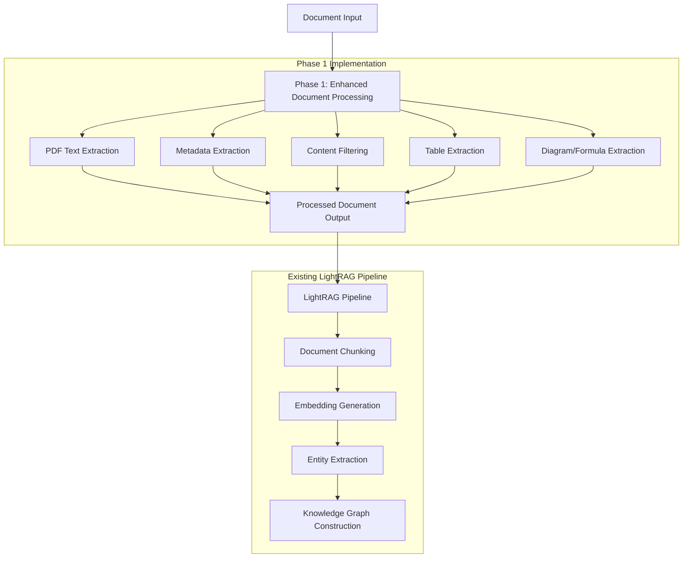

# Phase 1 Implementation Checklist

## Task 1.1: Advanced PDF Parsing

- [x] Implement robust PDF text extraction
  - [x] Create `extract_structured_text_from_pdf` function using PyMuPDF (fitz)
  - [x] Implement text extraction preserving document structure
  - [x] Add robust error handling for various scenarios
  - [x] Handle edge cases like empty pages and multi-column layouts

- [x] Write tests for PDF text extraction
  - [x] Test extraction from valid PDFs
  - [x] Test handling of invalid/corrupted PDFs
  - [x] Test handling of non-existent files
  - [x] Test handling of files with invalid extensions
  - [x] Test handling of empty pages

## Task 1.2: Metadata Extraction

- [x] Implement PDF metadata extraction
  - [x] Create `extract_pdf_metadata` function
  - [x] Extract standard PDF metadata fields (title, author, etc.)
  - [x] Extract document statistics (page count, etc.)
  - [x] Normalize dates to ISO 8601 format
  - [x] Add robust error handling

- [x] Implement file system metadata extraction
  - [x] Create `extract_file_metadata` function
  - [x] Extract file system attributes (size, timestamps, path information)
  - [x] Normalize dates to ISO 8601 format
  - [x] Add robust error handling

- [x] Implement combined document processing
  - [x] Create `process_pdf_document` function
  - [x] Combine text extraction and metadata extraction
  - [x] Return structured document data

- [x] Write tests for metadata extraction
  - [x] Test PDF metadata extraction
  - [x] Test file system metadata extraction
  - [x] Test combined document processing
  - [x] Test handling of invalid inputs and error conditions

## Task 1.3: Content Filtering

- [x] Implement content filtering
  - [x] Create `ContentFilter` class
  - [x] Implement pattern-based filtering for headers, footers, page numbers, etc.
  - [x] Implement TOC and index page detection
  - [x] Add configuration option to enable/disable filtering

- [x] Implement text filtering function
  - [x] Create `filter_extracted_text` function
  - [x] Integrate with PDF parser to filter content post-extraction
  - [x] Add detailed logging of filtering statistics

- [x] Write tests for content filtering
  - [x] Test filtering of individual lines
  - [x] Test filtering of complete text
  - [x] Test TOC and index page detection
  - [x] Test integration with PDF parser

## Task 1.4: Table Extraction

- [x] Implement table extraction
  - [x] Create `TableExtractor` class
  - [x] Implement `extract_tables_to_markdown` function
  - [x] Implement `extract_tables_with_metadata` function
  - [x] Add support for multiple table extraction engines (pdfplumber, camelot)
  - [x] Add robust error handling

- [x] Implement table data conversion utilities
  - [x] Create `table_data_to_df` function for converting table data to pandas DataFrames
  - [x] Implement Markdown formatting for tables

- [x] Integrate table extraction with PDF parser
  - [x] Add table extraction to `process_pdf_document` function
  - [x] Include extracted tables in document processing output

- [x] Write tests for table extraction
  - [x] Test table extraction from PDFs with tables
  - [x] Test handling of PDFs without tables
  - [x] Test handling of PDFs with empty tables
  - [x] Test handling of tables with None values
  - [x] Test error handling and edge cases

## Task 1.5: Diagram/Formula Placeholders

- [x] Implement diagram detection and extraction
  - [x] Create `DiagramAnalyzer` class
  - [x] Implement image analysis heuristics for diagram detection
  - [x] Extract diagrams with metadata
  - [x] Generate diagram descriptions
  - [x] Replace diagrams with unique placeholders in text content

- [x] Implement formula detection and extraction
  - [x] Create `FormulaExtractor` class
  - [x] Implement regex patterns for formula detection
  - [x] Extract formulas with context
  - [x] Convert formulas to textual representations
  - [x] Replace formulas with unique placeholders in text content

- [x] Integrate diagram and formula extraction with PDF parser
  - [x] Add diagram and formula extraction to `process_pdf_document` function
  - [x] Store extracted elements in the document processing output
  - [x] Add configuration options to enable/disable diagram and formula extraction

- [x] Write tests for diagram and formula extraction
  - [x] Test diagram detection and extraction
  - [x] Test formula detection and extraction
  - [x] Test placeholder replacement
  - [x] Test integration with PDF parser
  - [x] Test error handling and edge cases

## Verification

- [x] All tests pass without warnings or skips
- [x] High code coverage for all new modules (95%+)
- [x] PDF parser correctly extracts text, metadata, tables, diagrams, and formulas
- [x] Content filtering correctly removes non-RAG useful content
- [x] Table extraction correctly converts tables to Markdown
- [x] Diagram and formula extraction correctly replaces elements with placeholders
- [x] All components handle error conditions gracefully

## Phase 1 Integration with LightRAG Pipeline

Phase 1 implements enhanced document processing capabilities that are designed to be integrated into LightRAG's existing document ingestion pipeline. The implementation enhances the document processing stage that occurs before chunking and knowledge graph construction.

### Integration Details

1. **Integration Point**: The enhanced document processing functions from Phase 1 are called before the existing chunking phase in LightRAG's pipeline.

2. **Data Flow**: The document processing module takes raw document files (PDFs) as input and outputs structured data (text content, metadata, extracted elements) that is then passed to the chunking phase.

3. **Pipeline Modification**: The implementation modifies the existing pipeline by enhancing the document processing capabilities without replacing the core pipeline structure.

### Data Flow Diagram

### Implementation Notes

- The Phase 1 implementation creates a new `document_processing` module with functions like `process_pdf_document` that handle the enhanced document processing.
- The output of Phase 1 processing includes:
  - Extracted text content
  - Document metadata
  - Extracted elements (tables, diagrams, formulas) with placeholders in the text
- This structured output is then passed to the existing chunking phase, which has been modified in Phase 2 to handle the additional metadata and extracted elements.
- The implementation preserves the existing pipeline structure while enhancing its capabilities, following the principle of "Integration, Not Replacement" mentioned in the overall enhancement context.
