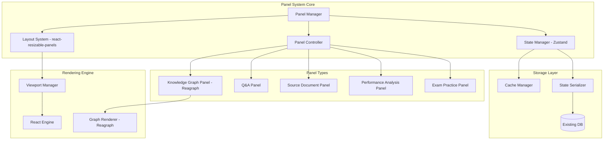

# LightRAG Panel-Based UI Product Requirements Document

## 1. Executive Summary

This PRD defines the implementation of a professional panel-based UI system for LightRAG, designed to support multi-context learning experiences for certification exam preparation. The system emphasizes performance, mode switching capabilities, and extensibility across different exam types. The implementation is optimized for development with Claude Code, prioritizing simplicity, clear documentation, and established libraries.

## 2. Technology Stack (Claude Code Optimized)

### Core Framework
- **React** (existing framework)
- **react-resizable-panels** - Simple, well-documented panel management
- **Zustand** - State management (already in use)
- **Tailwind CSS** - Utility-first styling
- **Radix UI** - Accessible component primitives

### Knowledge Graph Visualization
- **Reagraph** or **react-force-graph** - React-based graph visualization with WebGL performance
- Abstracts WebGL complexity while maintaining performance

### Supporting Libraries
- **react-markdown** - Markdown rendering for Q&A
- **react-window** - Virtual scrolling for performance
- **framer-motion** - Simple animations

## 3. System Architecture Overview



## 4. Core Components Specification

### 4.1 Panel Manager (Simplified for Claude Code)

```typescript
// Simple panel manager using react-resizable-panels
import { Panel, PanelGroup, PanelResizeHandle } from "react-resizable-panels";

interface PanelManager {
  // Simplified lifecycle
  registerPanel(panelId: string, component: React.ComponentType): void
  unregisterPanel(panelId: string): void
  
  // Layout management using built-in features
  setLayout(layoutConfig: LayoutConfig): void
  saveLayout(): LayoutConfig
  
  // State sync with Zustand
  syncState(): void
}

// Example implementation
function PanelLayout() {
  return (
    <PanelGroup direction="horizontal" id="main-layout">
      <Panel defaultSize={50} minSize={20}>
        <KnowledgeGraphPanel />
      </Panel>
      <PanelResizeHandle className="w-2 bg-gray-200 hover:bg-gray-300" />
      <Panel defaultSize={50} minSize={20}>
        <PanelGroup direction="vertical">
          <Panel defaultSize={60}>
            <QAPanel />
          </Panel>
          <PanelResizeHandle className="h-2 bg-gray-200 hover:bg-gray-300" />
          <Panel defaultSize={40}>
            <SourceDocumentPanel />
          </Panel>
        </PanelGroup>
      </Panel>
    </PanelGroup>
  );
}
```

**TODO Items:**
- [ ] Implement panel registration system
- [ ] Create layout configuration types
- [ ] Build Zustand store for panel state
- [ ] Implement layout persistence
- [ ] Create panel lifecycle hooks
- [ ] Build error boundaries for panels
- [ ] Implement panel visibility toggles
- [ ] Create keyboard shortcuts for panels

### 4.2 Layout System (Using react-resizable-panels)

```typescript
// Simplified layout system leveraging react-resizable-panels
interface LayoutConfig {
  id: string
  name: string
  description: string
  panels: PanelConfig[]
  direction: 'horizontal' | 'vertical'
}

interface PanelConfig {
  id: string
  type: PanelType
  defaultSize: number
  minSize: number
  children?: PanelConfig[] // For nested panels
}

// Preset layouts
const layoutPresets: LayoutConfig[] = [
  {
    id: 'concept-explorer',
    name: 'Concept Explorer',
    description: 'Focus on knowledge graph exploration',
    direction: 'horizontal',
    panels: [
      { id: 'kg', type: 'knowledge-graph', defaultSize: 70, minSize: 40 },
      { id: 'qa', type: 'qa', defaultSize: 30, minSize: 20 }
    ]
  },
  {
    id: 'deep-study',
    name: 'Deep Study',
    description: 'Comprehensive learning with sources',
    direction: 'horizontal',
    panels: [
      { id: 'qa', type: 'qa', defaultSize: 40, minSize: 30 },
      { id: 'sources', type: 'source', defaultSize: 30, minSize: 20 },
      { id: 'notes', type: 'notes', defaultSize: 30, minSize: 20 }
    ]
  }
]
```

**TODO Items:**
- [ ] Create dynamic panel group renderer
- [ ] Implement layout preset switcher
- [ ] Build resize persistence
- [ ] Add smooth transition animations
- [ ] Create responsive breakpoints
- [ ] Implement panel collapse/expand
- [ ] Build layout validation
- [ ] Add keyboard navigation

### 4.3 State Management (Zustand Implementation)

```typescript
// Zustand store for panel system
import { create } from 'zustand'
import { persist } from 'zustand/middleware'

interface PanelState {
  // Active layout
  currentLayout: string
  layouts: Map<string, LayoutConfig>
  
  // Panel states
  panelStates: Map<string, {
    isVisible: boolean
    size: number
    collapsed: boolean
  }>
  
  // Actions
  setLayout: (layoutId: string) => void
  updatePanelSize: (panelId: string, size: number) => void
  togglePanel: (panelId: string) => void
  saveCustomLayout: (name: string) => void
}

const usePanelStore = create<PanelState>()(
  persist(
    (set, get) => ({
      currentLayout: 'concept-explorer',
      layouts: new Map(layoutPresets.map(l => [l.id, l])),
      panelStates: new Map(),
      
      setLayout: (layoutId) => set({ currentLayout: layoutId }),
      
      updatePanelSize: (panelId, size) => set((state) => ({
        panelStates: new Map(state.panelStates).set(panelId, {
          ...state.panelStates.get(panelId)!,
          size
        })
      })),
      
      togglePanel: (panelId) => set((state) => ({
        panelStates: new Map(state.panelStates).set(panelId, {
          ...state.panelStates.get(panelId)!,
          isVisible: !state.panelStates.get(panelId)?.isVisible
        })
      })),
      
      saveCustomLayout: (name) => {
        const current = get().currentLayout
        const currentConfig = get().layouts.get(current)
        if (currentConfig) {
          set((state) => ({
            layouts: new Map(state.layouts).set(name, {
              ...currentConfig,
              id: name,
              name
            })
          }))
        }
      }
    }),
    {
      name: 'panel-storage',
      partialize: (state) => ({
        currentLayout: state.currentLayout,
        layouts: Array.from(state.layouts.entries()),
        panelStates: Array.from(state.panelStates.entries())
      })
    }
  )
)
```

**TODO Items:**
- [ ] Implement state persistence
- [ ] Create state migration logic
- [ ] Add optimistic updates
- [ ] Build state validation
- [ ] Implement undo/redo
- [ ] Create state debugging tools
- [ ] Add performance monitoring
- [ ] Build state synchronization

### 4.4 Knowledge Graph Panel (Using Reagraph)

```typescript
// Simplified knowledge graph using Reagraph
import { GraphCanvas } from 'reagraph';

interface KnowledgeGraphPanel {
  data: GraphData
  onNodeClick: (node: Node) => void
  onEdgeClick: (edge: Edge) => void
}

function KnowledgeGraphPanel({ data, onNodeClick, onEdgeClick }: KnowledgeGraphPanel) {
  return (
    <div className="w-full h-full relative">
      <GraphCanvas
        nodes={data.nodes}
        edges={data.edges}
        onNodeClick={onNodeClick}
        onEdgeClick={onEdgeClick}
        layoutType="forceDirected2d"
        theme={{
          canvas: { background: '#ffffff' },
          node: {
            fill: '#7B68EE',
            activeFill: '#0066FF',
            label: {
              color: '#212529',
              fontSize: 12
            }
          },
          edge: {
            fill: '#ADB5BD',
            activeFill: '#0066FF'
          }
        }}
      />
      <GraphControls />
    </div>
  );
}

// Simple graph controls
function GraphControls() {
  return (
    <div className="absolute top-4 right-4 flex flex-col gap-2">
      <button className="p-2 bg-white rounded shadow">
        <ZoomIn className="w-4 h-4" />
      </button>
      <button className="p-2 bg-white rounded shadow">
        <ZoomOut className="w-4 h-4" />
      </button>
      <button className="p-2 bg-white rounded shadow">
        <Maximize className="w-4 h-4" />
      </button>
    </div>
  );
}
```

**TODO Items:**
- [ ] Implement Reagraph integration
- [ ] Create node/edge data transformers
- [ ] Build interaction handlers
- [ ] Add zoom/pan controls
- [ ] Implement node clustering
- [ ] Create search functionality
- [ ] Add layout algorithms
- [ ] Build performance optimization
- [ ] Implement highlight system
- [ ] Create legend component

### 4.5 Q&A Panel (Claude Code Friendly)

```typescript
// Simple Q&A panel with clear structure
interface QAPanel {
  conversation: Message[]
  onSendMessage: (message: string) => void
  isLoading: boolean
}

function QAPanel({ conversation, onSendMessage, isLoading }: QAPanel) {
  const [input, setInput] = useState('');
  
  return (
    <div className="flex flex-col h-full">
      {/* Messages area */}
      <div className="flex-1 overflow-y-auto p-4">
        {conversation.map((message) => (
          <MessageBubble key={message.id} message={message} />
        ))}
        {isLoading && <LoadingIndicator />}
      </div>
      
      {/* Input area */}
      <div className="border-t p-4">
        <form onSubmit={(e) => {
          e.preventDefault();
          onSendMessage(input);
          setInput('');
        }}>
          <div className="flex gap-2">
            <input
              type="text"
              value={input}
              onChange={(e) => setInput(e.target.value)}
              className="flex-1 px-3 py-2 border rounded"
              placeholder="Ask a question..."
            />
            <button
              type="submit"
              className="px-4 py-2 bg-blue-500 text-white rounded"
              disabled={!input.trim() || isLoading}
            >
              Send
            </button>
          </div>
        </form>
      </div>
    </div>
  );
}

// Simple message component
function MessageBubble({ message }: { message: Message }) {
  return (
    <div className={`mb-4 ${message.role === 'user' ? 'text-right' : 'text-left'}`}>
      <div className={`inline-block p-3 rounded-lg max-w-[80%] ${
        message.role === 'user' 
          ? 'bg-blue-100 text-blue-900' 
          : 'bg-gray-100 text-gray-900'
      }`}>
        <ReactMarkdown>{message.content}</ReactMarkdown>
        {message.citations && (
          <div className="mt-2 text-sm">
            {message.citations.map((citation, idx) => (
              <Citation key={idx} citation={citation} />
            ))}
          </div>
        )}
      </div>
    </div>
  );
}
```

**TODO Items:**
- [ ] Implement message components
- [ ] Create markdown renderer
- [ ] Build citation system
- [ ] Add message streaming
- [ ] Implement auto-scroll
- [ ] Create loading states
- [ ] Add keyboard shortcuts
- [ ] Build export functionality
- [ ] Implement search within chat
- [ ] Create annotation system

### 4.6 Panel Communication (Simple Event System)

```typescript
// Simple event bus for Claude Code
class EventBus {
  private listeners: Map<string, Set<Function>> = new Map();
  
  on(event: string, callback: Function) {
    if (!this.listeners.has(event)) {
      this.listeners.set(event, new Set());
    }
    this.listeners.get(event)!.add(callback);
    
    // Return unsubscribe function
    return () => {
      this.listeners.get(event)?.delete(callback);
    };
  }
  
  emit(event: string, data?: any) {
    this.listeners.get(event)?.forEach(callback => {
      callback(data);
    });
  }
}

// Global event bus instance
export const panelEventBus = new EventBus();

// Usage example
function KnowledgeGraphPanel() {
  const handleNodeClick = (node: Node) => {
    panelEventBus.emit('node-selected', { nodeId: node.id });
  };
  
  return <GraphCanvas onNodeClick={handleNodeClick} />;
}

function QAPanel() {
  useEffect(() => {
    const unsubscribe = panelEventBus.on('node-selected', (data) => {
      // Update Q&A context based on selected node
      console.log('Node selected:', data.nodeId);
    });
    
    return unsubscribe;
  }, []);
  
  return <div>Q&A Panel</div>;
}
```

**TODO Items:**
- [ ] Implement event bus
- [ ] Define event types
- [ ] Create event handlers
- [ ] Add event logging
- [ ] Build debugging tools
- [ ] Implement event filtering
- [ ] Add performance monitoring
- [ ] Create event documentation

## 5. Visual Design System (Tailwind-based)

### 5.1 Design Tokens

```typescript
// Tailwind configuration for consistent design
const theme = {
  colors: {
    // Base colors
    background: {
      primary: '#FFFFFF',
      secondary: '#F8F9FA',
      tertiary: '#F1F3F5'
    },
    
    // Accent colors
    accent: {
      blue: '#0066FF',
      green: '#00D68F',
      yellow: '#FFB800',
      pink: '#FF3D71',
      cyan: '#00B8D9'
    },
    
    // Panel colors
    panel: {
      'knowledge-graph': '#7B68EE',
      'qa': '#00CED1',
      'source': '#FF6347',
      'performance': '#32CD32'
    }
  }
}

// Tailwind components
const panelClasses = {
  container: 'bg-white rounded-lg shadow-sm border border-gray-200',
  header: 'px-4 py-3 border-b border-gray-100 flex items-center justify-between',
  content: 'p-4',
  resizeHandle: 'bg-gray-200 hover:bg-gray-300 transition-colors'
}
```

**TODO Items:**
- [ ] Create Tailwind config
- [ ] Build component classes
- [ ] Implement dark mode
- [ ] Create animation utilities
- [ ] Build responsive utilities
- [ ] Add accessibility classes
- [ ] Create loading states
- [ ] Build error states

### 5.2 Panel Chrome Components

```tsx
// Simple panel chrome using Tailwind
function PanelChrome({ 
  title, 
  icon: Icon, 
  children, 
  onClose,
  accentColor = 'blue'
}: PanelChromeProps) {
  return (
    <div className="h-full flex flex-col bg-white rounded-lg shadow-sm border border-gray-200">
      {/* Header */}
      <div className="px-4 py-3 border-b border-gray-100 flex items-center justify-between">
        <div className="flex items-center gap-2">
          {Icon && <Icon className={`w-5 h-5 text-${accentColor}-500`} />}
          <h3 className="font-medium text-gray-900">{title}</h3>
        </div>
        <button
          onClick={onClose}
          className="p-1 rounded hover:bg-gray-100 transition-colors"
        >
          <X className="w-4 h-4 text-gray-500" />
        </button>
      </div>
      
      {/* Content */}
      <div className="flex-1 overflow-auto">
        {children}
      </div>
    </div>
  );
}
```

**TODO Items:**
- [ ] Create panel header component
- [ ] Build panel controls
- [ ] Implement status indicators
- [ ] Create panel menu
- [ ] Add drag handles
- [ ] Build tooltip system
- [ ] Create badge component
- [ ] Implement panel actions

## 6. Testing Strategy (Claude Code Friendly)

### 6.1 Simple Test Structure

```typescript
// Using React Testing Library for clarity
import { render, screen, fireEvent } from '@testing-library/react';
import '@testing-library/jest-dom';

describe('Panel System', () => {
  describe('Panel Manager', () => {
    it('renders panels correctly', () => {
      render(<PanelLayout />);
      
      expect(screen.getByText('Knowledge Graph')).toBeInTheDocument();
      expect(screen.getByText('Q&A')).toBeInTheDocument();
    });
    
    it('handles resize interactions', async () => {
      render(<PanelLayout />);
      
      const resizeHandle = screen.getByRole('separator');
      fireEvent.mouseDown(resizeHandle);
      fireEvent.mouseMove(resizeHandle, { clientX: 100 });
      fireEvent.mouseUp(resizeHandle);
      
      // Verify panel sizes updated
    });
  });
  
  describe('Knowledge Graph', () => {
    it('renders graph with nodes', () => {
      const mockData = {
        nodes: [{ id: '1', label: 'Node 1' }],
        edges: []
      };
      
      render(<KnowledgeGraphPanel data={mockData} />);
      
      expect(screen.getByText('Node 1')).toBeInTheDocument();
    });
  });
});

// Simple performance test
describe('Performance', () => {
  it('renders large graphs efficiently', () => {
    const startTime = performance.now();
    
    const largeGraph = {
      nodes: Array.from({ length: 1000 }, (_, i) => ({
        id: `node-${i}`,
        label: `Node ${i}`
      })),
      edges: []
    };
    
    render(<KnowledgeGraphPanel data={largeGraph} />);
    
    const renderTime = performance.now() - startTime;
    expect(renderTime).toBeLessThan(1000); // Should render in under 1 second
  });
});
```

**TODO Items:**
- [ ] Set up testing environment
- [ ] Create test utilities
- [ ] Write component tests
- [ ] Add integration tests
- [ ] Create performance tests
- [ ] Build accessibility tests
- [ ] Add visual regression tests
- [ ] Create test documentation

## 7. Development Workflow for Claude Code

### 7.1 Incremental Development Approach

```typescript
// Start with static layout
function StaticPanelLayout() {
  return (
    <div className="h-screen flex">
      <div className="w-1/2 border-r">
        <KnowledgeGraphPanel />
      </div>
      <div className="w-1/2">
        <QAPanel />
      </div>
    </div>
  );
}

// Add resizing capability
function ResizablePanelLayout() {
  return (
    <PanelGroup direction="horizontal">
      <Panel defaultSize={50}>
        <KnowledgeGraphPanel />
      </Panel>
      <PanelResizeHandle />
      <Panel defaultSize={50}>
        <QAPanel />
      </Panel>
    </PanelGroup>
  );
}

// Add state management
function StatefulPanelLayout() {
  const { currentLayout, setLayout } = usePanelStore();
  
  return (
    <div>
      <LayoutSelector 
        current={currentLayout} 
        onChange={setLayout} 
      />
      <DynamicPanelRenderer layout={currentLayout} />
    </div>
  );
}
```

### 7.2 Claude Code Prompts

Example prompts for development:

```
"Create a ResizablePanel component using react-resizable-panels 
that has a KnowledgeGraph panel on the left and a QAPanel on the 
right. The left panel should default to 40% width. Add smooth 
resize animations with Tailwind CSS."

"Implement a Zustand store for managing panel states including 
visibility, size, and layout configuration. Include persistence 
using the persist middleware."

"Create a KnowledgeGraphPanel component using Reagraph that 
displays nodes and edges with a force-directed layout. Add 
zoom controls and node click handlers."
```

## 8. Implementation Checklist

### Phase 1: Foundation (Start Here)
- [ ] Set up React project structure
- [ ] Install core dependencies (react-resizable-panels, zustand, tailwind)
- [ ] Create basic static layout
- [ ] Implement simple panel components
- [ ] Add Tailwind styling

### Phase 2: Panel System
- [ ] Integrate react-resizable-panels
- [ ] Create panel wrapper components
- [ ] Add resize functionality
- [ ] Implement panel collapse/expand
- [ ] Build layout switching

### Phase 3: State Management
- [ ] Set up Zustand store
- [ ] Implement layout persistence
- [ ] Add panel state tracking
- [ ] Create state debugging tools
- [ ] Build undo/redo functionality

### Phase 4: Knowledge Graph
- [ ] Integrate Reagraph
- [ ] Create node/edge components
- [ ] Add interaction handlers
- [ ] Implement zoom/pan
- [ ] Build search functionality

### Phase 5: Q&A Panel
- [ ] Create chat interface
- [ ] Add markdown rendering
- [ ] Implement message streaming
- [ ] Build citation system
- [ ] Add export functionality

### Phase 6: Panel Communication
- [ ] Create event bus
- [ ] Implement panel events
- [ ] Add cross-panel updates
- [ ] Build debugging tools
- [ ] Create event documentation

### Phase 7: Visual Polish
- [ ] Refine Tailwind theme
- [ ] Add animations
- [ ] Create loading states
- [ ] Build error states
- [ ] Implement dark mode

### Phase 8: Testing
- [ ] Set up test framework
- [ ] Write unit tests
- [ ] Add integration tests
- [ ] Create E2E tests
- [ ] Build performance tests

### Phase 9: Documentation
- [ ] Document components
- [ ] Create usage guides
- [ ] Build examples
- [ ] Write troubleshooting guide
- [ ] Create contribution guide

### Phase 10: Optimization
- [ ] Profile performance
- [ ] Optimize render cycles
- [ ] Add code splitting
- [ ] Implement lazy loading
- [ ] Create production build

## 9. Success Metrics

### 9.1 Performance Targets
- Panel resize: Smooth 60fps
- Layout switching: < 200ms
- Graph rendering: < 1s for 1000 nodes
- Memory usage: < 300MB typical session

### 9.2 Code Quality
- Clear, readable code structure
- Comprehensive test coverage
- Well-documented components
- Minimal external dependencies

### 9.3 Developer Experience
- Easy to understand with Claude Code
- Incremental development possible
- Clear error messages
- Simple debugging process

This PRD is optimized for Claude Code development, emphasizing simplicity, established libraries, and incremental implementation approaches.