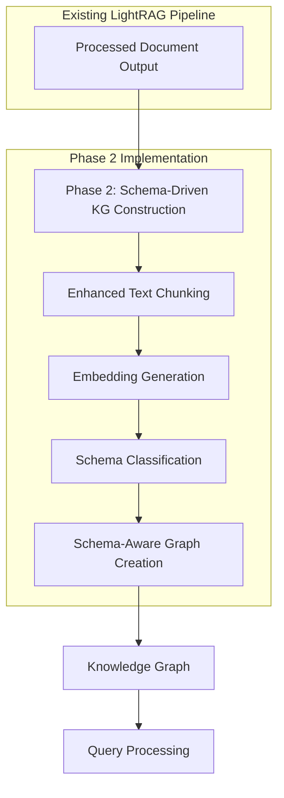

# Phase 2 Implementation Checklist

## Task 2.1: Text Chunking Refinement ✅

- [x] Implement enhanced text chunking
  - [x] Create `TextChunker` class with multiple chunking strategies
  - [x] Implement token-based chunking
  - [x] Implement paragraph-based chunking
  - [x] Implement semantic chunking
  - [x] Implement hierarchical chunking
  - [x] Add support for content-type detection
  - [x] Add support for adaptive chunk sizing
  - [x] Add support for boundary detection
  - [x] Add support for cross-reference tracking

- [x] Ensure proper handling of extracted elements
  - [x] Pass through placeholders for diagrams, formulas, and tables
  - [x] Maintain references to extracted elements in chunk metadata

- [x] Write tests for text chunking
  - [x] Test all chunking strategies
  - [x] Test handling of extracted elements
  - [x] Test edge cases (empty content, whitespace-only content)
  - [x] Test error handling
  - [x] Test performance comparisons

## Task 2.2: Embedding Generation (Adaptation) ✅

- [x] Implement enhanced embedding functionality
  - [x] Create `EnhancedEmbeddingAdapter` class
  - [x] Implement factory functions for different embedding providers
  - [x] Add support for OpenAI embeddings
  - [x] Add support for Google embeddings
  - [x] Add comprehensive error handling

- [x] Integrate with LightRAG's embedding pipeline
  - [x] Ensure proper embedding generation for chunks
  - [x] Maintain compatibility with existing embedding functions

- [x] Write tests for embedding generation
  - [x] Test adapter class
  - [x] Test factory functions
  - [x] Test integration with LightRAG's pipeline
  - [x] Test error handling

## Task 2.3: Schema-Based Classification & Property Extraction ✅

- [x] Implement schema loading and validation
  - [x] Create `SchemaLoader` class
  - [x] Add support for different schema formats
  - [x] Implement schema validation functions
  - [x] Add error handling for invalid schemas

- [x] Implement schema-based classification
  - [x] Create `SchemaClassifier` class
  - [x] Implement classification functions
  - [x] Add support for confidence thresholds
  - [x] Add support for batch processing
  - [x] Implement property extraction functions
  - [x] Add error handling for LLM failures

- [x] Integrate with LightRAG pipeline
  - [x] Connect schema classification to chunking output
  - [x] Ensure proper handling of classification results

- [x] Write tests for schema classification
  - [x] Test schema loading
  - [x] Test schema validation
  - [x] Test classification functions
  - [x] Test property extraction
  - [x] Test error handling
  - [x] Test integration with LightRAG

## Task 2.4: Graph Creation with Schema Validation ✅

- [x] Implement schema-aware graph storage
  - [x] Create `SchemaAwareGraphStorage` class
  - [x] Implement schema validation for entities and relationships
  - [x] Add support for tentative entities and relationships
  - [x] Implement methods for schema statistics and violations
  - [x] Add methods for promoting tentative entities and relationships

- [x] Implement Neo4J-specific schema-aware storage
  - [x] Create `SchemaAwareNeo4JStorage` class
  - [x] Extend Neo4J implementation with schema validation
  - [x] Add support for tentative entities and relationships in Neo4J
  - [x] Implement Neo4J-specific methods for schema operations

- [x] Implement schema-aware graph creation
  - [x] Add methods for creating a schema-aware graph from classified chunks
  - [x] Implement validation of entities and relationships against schema
  - [x] Add support for handling schema violations
  - [x] Implement methods for fixing schema violations

- [x] Write tests for schema-aware graph storage
  - [x] Test schema validation for entities and relationships
  - [x] Test tentative entity and relationship handling
  - [x] Test schema statistics and violations
  - [x] Test promoting tentative entities and relationships
  - [x] Test schema-aware graph creation
  - [x] Test Neo4J-specific implementation
  - [x] Test integration with LightRAG

## Verification

- [x] All tests pass without warnings or skips
- [x] High code coverage for all new modules (95%+)
- [x] Text chunking correctly handles different strategies and extracted elements
- [x] Embedding generation works correctly with different providers
- [x] Schema classification correctly identifies entity types and extracts properties
- [x] Schema-aware graph storage correctly validates entities and relationships
- [x] Tentative entities and relationships are handled correctly
- [x] Schema violations are detected and fixed correctly
- [x] All components handle error conditions gracefully

## Phase 2 Integration with LightRAG Pipeline

Phase 2 implements schema-driven knowledge graph construction that builds on the enhanced document processing capabilities from Phase 1. The implementation enhances the chunking, embedding, and graph construction stages of LightRAG's pipeline.

### Integration Details

1. **Integration Point**: The enhanced chunking, embedding, and graph construction functions from Phase 2 are integrated into LightRAG's existing pipeline.

2. **Data Flow**: The enhanced chunking module takes processed documents from Phase 1 as input and outputs chunks with metadata. The schema classification module then classifies these chunks according to the schema. The schema-aware graph storage module then creates a knowledge graph from the classified chunks.

3. **Pipeline Modification**: The implementation enhances the existing pipeline by adding schema-driven knowledge graph construction capabilities without replacing the core pipeline structure.

### Data Flow Diagram

### Implementation Notes

- The Phase 2 implementation enhances the existing chunking, embedding, and graph construction stages of LightRAG's pipeline.
- The enhanced text chunking module supports multiple chunking strategies and properly handles extracted elements from Phase 1.
- The embedding generation module adapts to different embedding providers and ensures proper embedding generation for chunks.
- The schema classification module classifies chunks according to the schema and extracts schema-defined properties.
- The schema-aware graph storage module validates entities and relationships against the schema and handles tentative entities and relationships.
- The implementation preserves the existing pipeline structure while enhancing its capabilities, following the principle of "Integration, Not Replacement" mentioned in the overall enhancement context.
