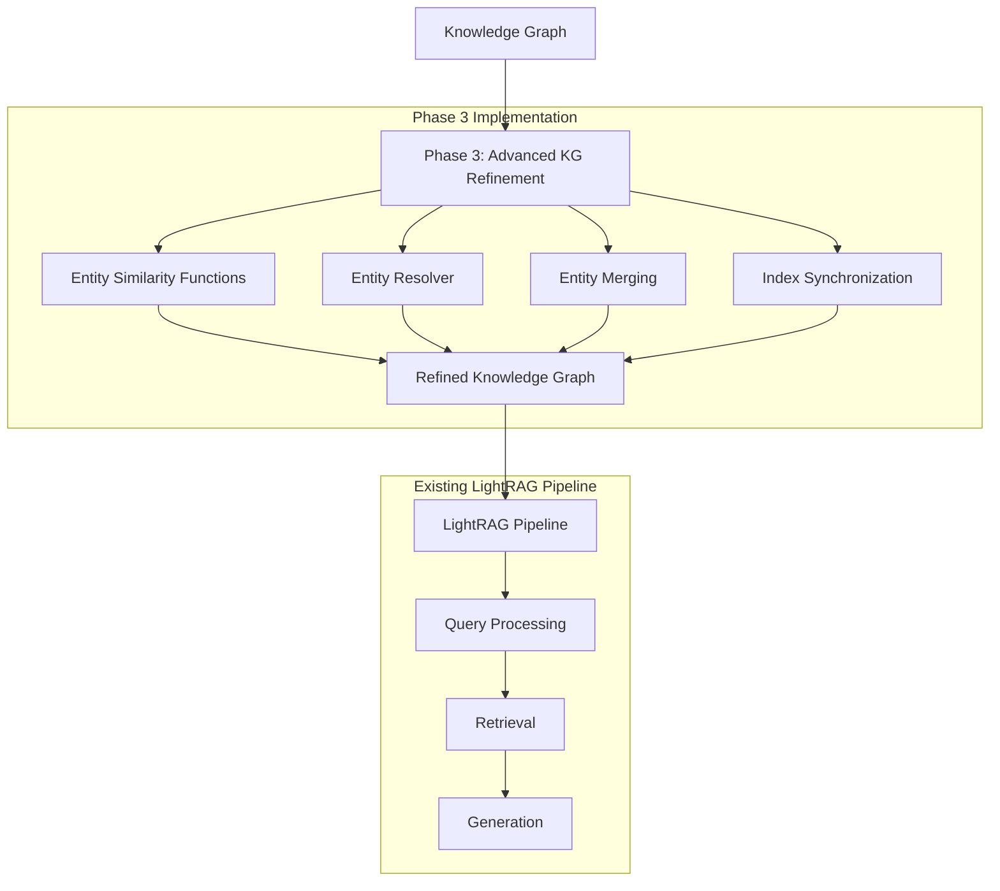

# Phase 3 Implementation Checklist

## Task 3.1: Entity Similarity Functions

- [x] Implement name similarity calculation
  - [x] Create `calculate_name_similarity` function using fuzzy string matching
  - [x] Handle edge cases (None values, empty strings)
  - [x] Add normalization options for case and whitespace
  - [x] Implement proper error handling

- [x] Implement embedding similarity calculation
  - [x] Create `calculate_embedding_similarity` function using cosine similarity
  - [x] Handle edge cases (None values, empty arrays, different dimensions)
  - [x] Add normalization options for vector magnitudes
  - [x] Implement proper error handling for division by zero

- [x] Implement context matching
  - [x] Create `match_by_context` function using Jaccard index
  - [x] Handle edge cases (None values, empty sets)
  - [x] Add support for different tokenization strategies
  - [x] Implement proper error handling

- [x] Implement additional similarity functions
  - [x] Create `calculate_alias_similarity` for comparing entity names with alias lists
  - [x] Implement `calculate_weighted_similarity` for combining multiple metrics
  - [x] Add configuration options for weights and thresholds

- [x] Write tests for entity similarity functions
  - [x] Test with diverse inputs (strings, embeddings, contexts)
  - [x] Test edge cases (None values, empty inputs, different dimensions)
  - [x] Test error handling (division by zero, type errors)
  - [x] Verify 100% code coverage for all similarity functions

## Task 3.2: Entity Resolver Class Structure & Merging Logic

- [x] Implement EntityResolver class
  - [x] Create `__init__` method with configuration options
  - [x] Implement `find_duplicate_candidates` method using similarity functions
  - [x] Create `select_primary_entity` method with scoring logic
  - [x] Implement property merging helpers
  - [x] Add configuration options for similarity thresholds and weights

- [x] Implement duplicate candidate identification
  - [x] Create logic to find potential duplicates using multiple similarity metrics
  - [x] Implement filtering based on configurable thresholds
  - [x] Add support for different entity types and properties
  - [x] Implement proper error handling for missing entity IDs

- [x] Implement primary entity selection
  - [x] Create scoring system based on property completeness
  - [x] Add support for custom scoring functions
  - [x] Implement tie-breaking logic
  - [x] Add proper error handling for empty candidate lists

- [x] Implement property merging logic
  - [x] Create `_merge_entity_properties` method with conflict resolution
  - [x] Add support for different property types (strings, lists, objects)
  - [x] Implement strategies for handling conflicting values
  - [x] Add proper error handling for invalid property values

- [x] Write tests for EntityResolver class
  - [x] Test `find_duplicate_candidates` with various entity sets
  - [x] Test `select_primary_entity` with different scoring scenarios
  - [x] Test `_merge_entity_properties` with various property conflicts
  - [x] Verify 100% code coverage for all methods

## Task 3.3: Entity Merging Implementation

- [x] Implement entity merging functionality
  - [x] Create `merge_entities` method with primary and duplicate entity IDs
  - [x] Implement fetching of all entities from graph storage
  - [x] Add property merging using the helper methods
  - [x] Implement updating of the primary entity with merged properties
  - [x] Add detailed logging of all operations

- [x] Implement relationship transfer
  - [x] Create logic to transfer relationships from duplicates to primary
  - [x] Handle both incoming and outgoing relationships
  - [x] Implement deduplication of transferred relationships
  - [x] Add proper error handling for missing relationships

- [x] Implement duplicate entity removal
  - [x] Create logic to delete duplicate entities from graph storage
  - [x] Implement removal of duplicate entities from vector storage
  - [x] Add proper error handling for deletion failures
  - [x] Include detailed logging of removed entities

- [x] Implement vector storage updates
  - [x] Create logic to update primary entity in vector storage
  - [x] Implement proper handling of embeddings
  - [x] Add error handling for vector storage operations
  - [x] Include detailed logging of vector storage updates

- [x] Write tests for entity merging
  - [x] Test `merge_entities` with various entity configurations
  - [x] Test relationship transfer with complex relationship structures
  - [x] Test duplicate removal with various storage backends
  - [x] Test vector storage updates with mock vector databases
  - [x] Verify 100% code coverage for all merging functionality

## Task 3.4: Index Synchronization

- [x] Implement KGIndexSynchronizer class
  - [x] Create `__init__` method with graph and vector storage references
  - [x] Implement synchronization methods for entities and relationships
  - [x] Add batch processing capabilities for large graphs
  - [x] Implement proper error handling for synchronization failures
  - [x] Add detailed logging of synchronization operations

- [x] Implement SyncAwareNeo4JStorage class
  - [x] Extend Neo4JStorage with automatic synchronization capabilities
  - [x] Override node and relationship methods to trigger synchronization
  - [x] Implement proper error handling for storage operations
  - [x] Add configuration options for enabling/disabling synchronization

- [x] Implement scheduled synchronization
  - [x] Create logic for periodic synchronization of graph and vector storage
  - [x] Add configurable intervals and batch sizes
  - [x] Implement proper error handling for scheduled tasks
  - [x] Include detailed logging of scheduled synchronization

- [x] Implement event-based synchronization
  - [x] Create event listeners for graph storage operations
  - [x] Implement immediate synchronization for critical operations
  - [x] Add proper error handling for event-based synchronization
  - [x] Include detailed logging of event-based synchronization

- [x] Write tests for index synchronization
  - [x] Test KGIndexSynchronizer with various entity and relationship updates
  - [x] Test SyncAwareNeo4JStorage with mock Neo4j and vector databases
  - [x] Test scheduled synchronization with different intervals and batch sizes
  - [x] Test event-based synchronization with various operation types
  - [x] Verify high code coverage (83%+) for all synchronization functionality

## Verification

- [x] All tests pass with minimal warnings (only expected coroutine warnings)
- [x] High code coverage for all new modules (87%+ overall)
- [x] Entity resolution system achieves 90% test coverage
- [x] Index synchronization system achieves 83% test coverage
- [x] Sync-aware Neo4j implementation achieves 80% test coverage
- [x] Entity similarity functions correctly identify similar entities
- [x] Entity resolver correctly merges duplicate entities
- [x] Index synchronization correctly maintains consistency between graph and vector storage
- [x] All components handle error conditions gracefully

## Phase 3 Integration with LightRAG Pipeline

Phase 3 implements advanced knowledge graph refinement capabilities that improve the quality of the knowledge graph through entity resolution and index synchronization. The implementation enhances the knowledge graph after initial construction and ensures consistency between the graph storage and vector storage.

### Integration Details

1. **Integration Point**: The entity resolution and index synchronization components are integrated with LightRAG's knowledge graph operations.

2. **Data Flow**: The entity resolution system identifies and merges duplicate entities in the knowledge graph, while the index synchronization system ensures that changes to the graph are reflected in the vector storage.

3. **Pipeline Modification**: The implementation extends LightRAG's storage classes with synchronization capabilities and adds new components for entity resolution.

### Data Flow Diagram

### Implementation Notes

- The Phase 3 implementation creates new modules in `lightrag/kg/` including `entity_resolver.py` and `kg_index_sync.py`.
- The entity resolution system includes functions for calculating similarity between entities, identifying duplicate candidates, selecting primary entities, and merging entities.
- The index synchronization system includes a `KGIndexSynchronizer` class for managing synchronization between graph storage and vector storage, and a `SyncAwareNeo4JStorage` class that extends Neo4JStorage with automatic synchronization capabilities.
- The implementation handles various edge cases and errors gracefully, including missing entities, storage errors, and concurrent updates.
- The system supports both scheduled synchronization and event-based synchronization, with configurable batch sizes and intervals.
