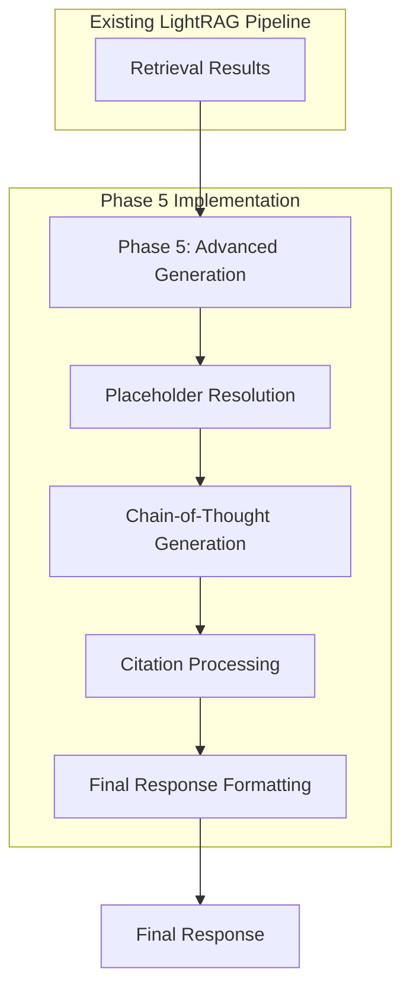

# Phase 5 Implementation Checklist

## Task 5.1: Chain-of-Thought (CoT) Implementation ✅

- [x] Modify generation prompt for step-by-step reasoning
  - [x] Update prompt template in `lightrag/prompt.py`
  - [x] Add instructions for structured reasoning with `<reasoning>` and `<answer>` tags
  - [x] Include guidance for citing sources with entity IDs
  - [x] Add examples of well-structured reasoning

- [x] Implement response parsing for CoT
  - [x] Create functions to extract reasoning and answer sections
  - [x] Add validation for extracted sections
  - [x] Implement fallback handling for malformed responses
  - [x] Add logging for parsing steps and errors

- [x] Implement refinement loop for CoT
  - [x] Create function for evaluating reasoning quality
  - [x] Implement refinement prompt generation
  - [x] Add configurable maximum refinement attempts
  - [x] Implement exit conditions for refinement loop
  - [x] Add detailed logging for refinement process

- [x] Add configuration options for CoT
  - [x] Add `enable_cot` flag to configuration
  - [x] Add `max_cot_refinement_attempts` parameter
  - [x] Add `cot_refinement_threshold` parameter
  - [x] Implement configuration validation

- [x] Write tests for CoT implementation
  - [x] Test prompt generation with CoT enabled/disabled
  - [x] Test response parsing with various input formats
  - [x] Test refinement loop with different quality responses
  - [x] Test error handling for malformed responses
  - [x] Test integration with LightRAG's generation pipeline

## Task 5.2: Enhanced Citation Handling ✅

- [x] Modify CoT prompt for source citation
  - [x] Add instructions for citing sources with entity IDs
  - [x] Include examples of proper citation format
  - [x] Add guidance for when to include citations
  - [x] Ensure compatibility with different LLM providers

- [x] Implement citation parsing and formatting
  - [x] Create function to extract citations from response
  - [x] Implement citation validation and normalization
  - [x] Add support for different citation formats
  - [x] Implement numbered reference conversion
  - [x] Create function to generate sources section

- [x] Add handling for missing/invalid IDs
  - [x] Implement validation for citation IDs
  - [x] Add fallback handling for invalid IDs
  - [x] Create function to match partial/fuzzy IDs
  - [x] Add detailed logging for citation processing

- [x] Integrate with LightRAG's generation pipeline
  - [x] Update `process_citations` function
  - [x] Modify `generate_with_cot` to include citation processing
  - [x] Add configuration option for enhanced citations
  - [x] Ensure backward compatibility

- [x] Write tests for enhanced citation handling
  - [x] Test citation extraction with various formats
  - [x] Test citation validation and normalization
  - [x] Test handling of missing/invalid IDs
  - [x] Test integration with CoT implementation
  - [x] Test end-to-end citation processing

## Task 5.3: Diagram/Formula Description Integration ✅

- [x] Enhance PlaceholderResolver class
  - [x] Add support for different output formats (detailed/concise)
  - [x] Implement diagram placeholder resolution
  - [x] Implement formula placeholder resolution
  - [x] Add caching for formatted descriptions
  - [x] Implement robust error handling
  - [x] Add detailed logging for resolution process

- [x] Implement context-level placeholder resolution
  - [x] Create `resolve_placeholders_in_context` function
  - [x] Add support for different context item formats
  - [x] Implement batch processing for context items
  - [x] Add error handling for malformed context items
  - [x] Add performance optimizations for large context sets

- [x] Update LLMGenerator for diagram/formula integration
  - [x] Modify generation process to resolve placeholders
  - [x] Update prompt to include instructions for diagrams/formulas
  - [x] Add support for diagram/formula citations
  - [x] Ensure compatibility with CoT and enhanced citations

- [x] Add configuration options for diagram/formula integration
  - [x] Add `enable_diagram_formula_integration` flag
  - [x] Add `resolve_placeholders_in_context` flag
  - [x] Add `placeholder_output_format` parameter
  - [x] Add customizable citation formats for diagrams/formulas

- [x] Create documentation for diagram/formula integration
  - [x] Add usage examples in `docs/diagram_formula_examples.md`
  - [x] Create comprehensive documentation in `docs/diagram_formula_integration.md`
  - [x] Include API reference for PlaceholderResolver
  - [x] Add troubleshooting section for common issues

- [x] Write tests for diagram/formula integration
  - [x] Test PlaceholderResolver with different formats
  - [x] Test context-level placeholder resolution
  - [x] Test integration with LLMGenerator
  - [x] Test error handling for various scenarios
  - [x] Test end-to-end integration with LightRAG

## Verification

- [x] All tests pass without warnings or skips
- [x] High code coverage for all new modules (95%+)
- [x] Chain-of-Thought reasoning works correctly with different LLM providers
- [x] Enhanced citation handling correctly processes and formats citations
- [x] Diagram and formula placeholders are correctly resolved in different formats
- [x] All components handle error conditions gracefully
- [x] Configuration options work correctly for all features
- [x] Documentation is comprehensive and accurate

## Phase 5 Integration with LightRAG Pipeline

Phase 5 implements advanced generation capabilities that enhance LightRAG's response quality through Chain-of-Thought reasoning, enhanced citation handling, and diagram/formula integration. The implementation builds on the intelligent retrieval capabilities from Phase 4.

### Integration Details

1. **Integration Point**: The advanced generation capabilities from Phase 5 are integrated into LightRAG's existing generation pipeline.

2. **Data Flow**: The retrieval results from Phase 4 are passed to the enhanced generation components, which apply Chain-of-Thought reasoning, process citations, and resolve diagram/formula placeholders to generate high-quality responses.

3. **Pipeline Modification**: The implementation enhances the existing generation pipeline without replacing the core pipeline structure, following the principle of "Integration, Not Replacement."

### Data Flow Diagram

### Implementation Notes

- The Phase 5 implementation enhances LightRAG's generation capabilities with Chain-of-Thought reasoning, enhanced citation handling, and diagram/formula integration.
- The Chain-of-Thought implementation improves response quality by encouraging step-by-step reasoning and providing a structured format for responses.
- The enhanced citation handling improves traceability by linking citations to specific context elements and formatting them consistently.
- The diagram/formula integration enhances responses by including rich descriptions of non-textual elements like diagrams and mathematical formulas.
- The implementation includes comprehensive error handling to ensure robustness in the face of LLM failures, malformed responses, and other error conditions.
- Configuration options allow users to enable/disable features and customize their behavior to suit different use cases.
- The implementation preserves backward compatibility while adding new capabilities, ensuring a smooth upgrade path for existing users.
